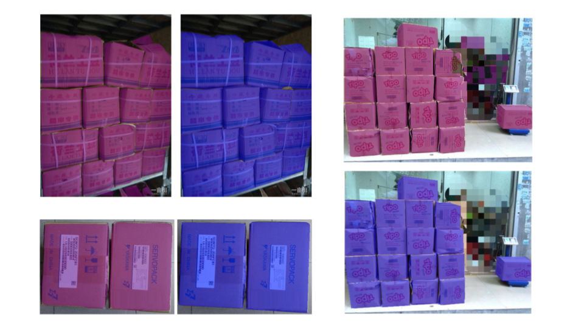

# Box Semantic Segmentation

This package contains a training Mask R-CNN model for box instance segmentation using Pytorch. 

## Setup

---

**Dataset**

Dataset contains cartoon boxes.

[SCD: A Stacked Carton Dataset for Detection and Segmentation](https://github.com/yancie-yjr/scd.github.io)

Challenges with the dataset:
1. Many samples do not contain background and contain only the boxes.
2. Boxes are very close to each other, and there is a lot of overlap between their bounding boxes.

**Augmentations**:

These augmentation methods were introduced into the dataset.

```python
RandomEqualize(p=0.2)
RandomPosterize(bits=3, p=0.5)
RandomHorizontalFlip(p=0.5))
RandomPerspective(distortion_scale=0.3, p=0.5)
```

**Model**

- Mask R-CNN [model](https://pytorch.org/vision/main/models/generated/torchvision.models.detection.maskrcnn_resnet50_fpn.html#torchvision.models.detection.maskrcnn_resnet50_fpn) with ResNet50 FPN backbone from Pytorch. pre-trained on COCO dataset.
- Changed the last output of the classification and segmentation heads.
- Changed the following parameters for Region Proposal Network.

  

| parameter | value |
| --- | --- |
| rpn_fg_iou_thresh | 0.8 |
| rpn_bg_iou_thresh | 0.4 |
| rpn_positive_fraction | 0.6 |
| rpn_nms_thresh | 0.6 |

**Optimizer**:

SGD with momentum and step learning rate scheduler.

| parameter | value |
| --- | --- |
| lr | 0.005 |
| momentum | 0.9 |
| weight decay | 0.0005 |

## Training

---

The model is trained using the aforementioned parameters for 20 epochs using a batch size of 2.

**Training losses**


**How to train?**

- Training is done on Cloab using Nvida L4 Tensor Core GPU with 24 GB memory using the following [script](https://github.com/AbdElRahmanFarhan/box_semantic_segmentation/blob/main/training_mask_rcnn.ipynb).
- Copy the dataset [zip](https://drive.google.com/file/d/1YeZ4mg_qZ4dBvKKfgGF8RQcyOMNoMp37/view) file into your Google Drive and rename it as OSCD.zip
- W&B was used to do hyperparameter tuning and visualise the training logs in real-time.
- Create an account on [W&B ](https://wandb.ai/site/) before running the script. When running the script, it will ask you to provide an API token, which you will find on your account.

## Evaluation

---

**Sample predictions**

- Purple is the detected mask.
- Blue is the ground truth mask.



**Evaluation metrics**

I reported the mask average precision and recall for IoU thresholds 0.5-0.95

| Metric | Value |
| --- | --- |
| Mask AP | 0.790 |
| Mask AR | 0.827 |

**How to evaluate?**

- Copy the trained [model](https://drive.google.com/file/d/1-5y4ohBNiYwDpl7cYOksdVqeQF3g1YR7/view?usp=drive_link) inside the directory OSCD/model in google drive.
- Run the evaluation script. [evaluate_maskrcnn.ipynb](https://github.com/AbdElRahmanFarhan/box_semantic_segmentation/blob/main/evaluate_maskrcnn.ipynb)
